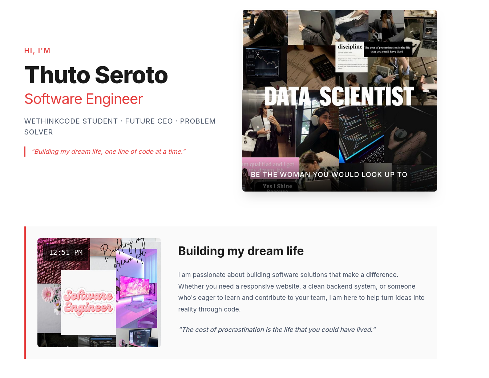

# Thuto Seroto - Software Engineer Portfolio

 <!-- Add a screenshot of your portfolio here later -->

Welcome to my personal portfolio repository! This is the source code for my software engineer portfolio website, showcasing my journey, skills, and projects as I pursue my Software Engineering qualification at WeThinkCode.

## 🚀 Live Site

Visit my portfolio live at: **[https://thutoseroto.github.io/MyPortfolio](https://thutoseroto.github.io/MyPortfolio)**

## 📋 About Me

I'm a passionate Software Engineering student at WeThinkCode, building my dream life one line of code at a time. My journey includes:

- **Software Engineering Qualification** - WeThinkCode (2025 - Present)
- **Diploma in Management Sciences** - Nelson Mandela University (2023-2024, incomplete)
- **National Senior Certificate (Matric)** - Itumeleng Secondary School (2021)

## 🛠️ Technologies & Tools

### Languages
- Python | Java | JavaScript | C#

### Web Technologies
- HTML5 | CSS3 | React | Node.js

### Databases & Backend
- SQL | PostgreSQL | Firebase | REST APIs

### Tools & Methods
- GitLab | GitHub | Docker | Linux | TDD | IntelliJ | VS Code

### Traits
- Bilingual | Team Player | Problem Solver | Reliability: High

## 💼 Work Experience

- **Educational Volunteer** - S.G Ntuane Primary School (2022)
  - Taught Economics, Mathematics, English, and Life Orientation
  
- **Retail / Customer Service Assistant** - Spar Sun Village (2022)
  - Customer service, stock management, and team collaboration

## 📁 Project Structure
## 🧮 Featured Project: Currency Calculator
A real-time currency converter supporting USD, ZAR, and BWP with live exchange rates.
[Try it here](https://thutoseroto.github.io/MyPortfolio/projects/currency-calculator/)

